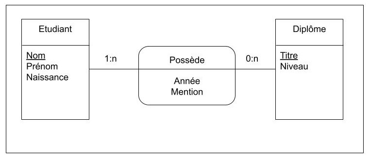
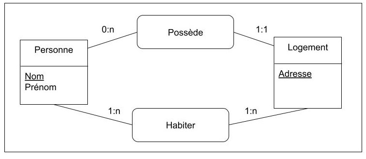
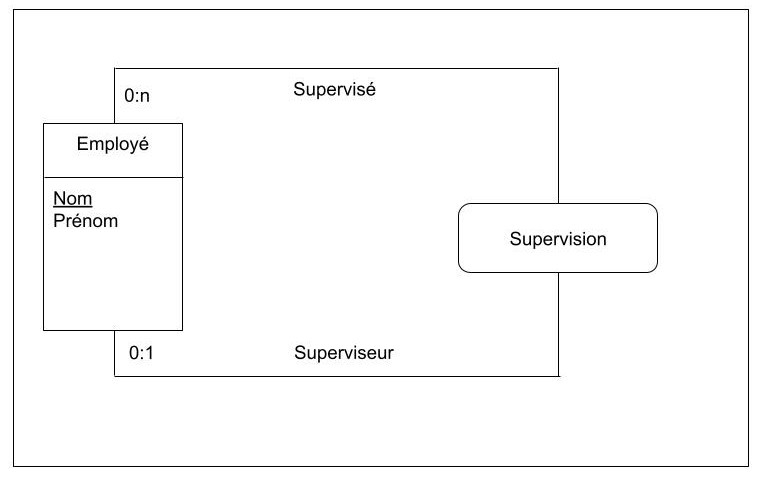
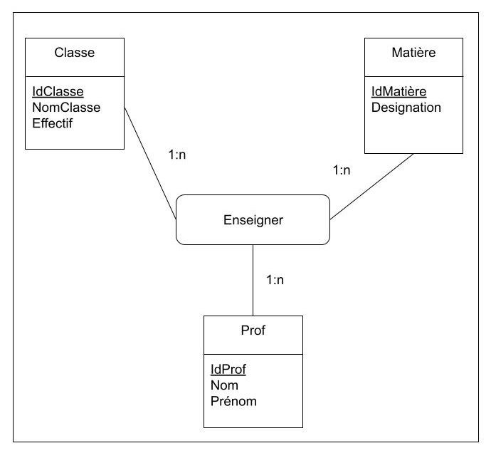

# 3.Merise : Modèle Conceptuel de Données (MCD) : Relations
Maintenant que vous savez créer des associations entre différentes **entités**, il est temps de passé aux relations. Il existe plusieurs types de relations. 

#### 1. Relation binaire
Une association entre deux entités. Prenons pour exemple:

```markdown
Un étudiant possède un diplomé
```

- **Entité étudiant** : (Nom, Prénom et Naissance)
- **Entité diplome** : (Titre, Niveau)
- **Association** : possède (année, mention)

Soit analysons les deux relations:

- Un étudiant possède **0:n** diplôme(s) => zéro ou plusieurs 
- Un diplôme est possédé par **1:n** étudiants => un ou plusieurs



#### 2. Partage d'une même collection
**Une collection** est l'ensemble des participants d'une association

```markdown
Une personne possède ET/OU habite dans une maison
```

- **Entité Personne** : (Nom, Prénom)
- **Entité Maison** : (Adresse)
- **Associations** : Habiter ET posseder

Analysons les relations:

- Une personne possède **1:1** logement => un et un
- Une personne habite **1:n** logement => un et plusieurs
- Un logement est possédé par **0:n** personne(s)=> zéro et plusieurs
- Un logement est habité par **1:n** personne(s) => un et plusieurs 



#### 3. Relation sur une même entité: soit une relation 1-aire, entité récursive
```markdown
Un employé est supervisé par une employé
```

Etrange que cela soit, c'est une entité très intéressante. En effet, on pourrait transposer ce modèle sur d'autres exemple, comme:

- Des commentaires d'un blog, on des sous commentaires
- Des catégories d'articles, peuvent avoir des sous catégories

Dans ce cas, on appelle cela des entité récurcives.

Analysons

- **Entité employé** : (Nom, Prénom et Naissance)
- **Associations** : Supervision

Soit

- Un employé est supervisé par **0:1** superviseur
- Un superviseur supervise **0:n** employé.



#### 4. Relation n-aires
Association entre au moin trois entités (ternaire)

```markdown
Une classe est enseigné par un ou plusieurs professeurs
Un professeur enseigne une ou plusieurs matières
Une matière est enseigné par un ou plusieurs professeurs
...
```

- **Entité classe** : (Idclasse, NomClasse, Effectif)
- **Entité Matière** : (IdMatière, Designation)
- **Entité Prof** : (IdProf, Nom, Prénom)

Analysons les relations:

- Une classe est enseigné par **1:n** professeur(s)
- Un professeur enseigne **1:n** matière(s)
- Une matière est enseigné par **1:n** professeur(s)



